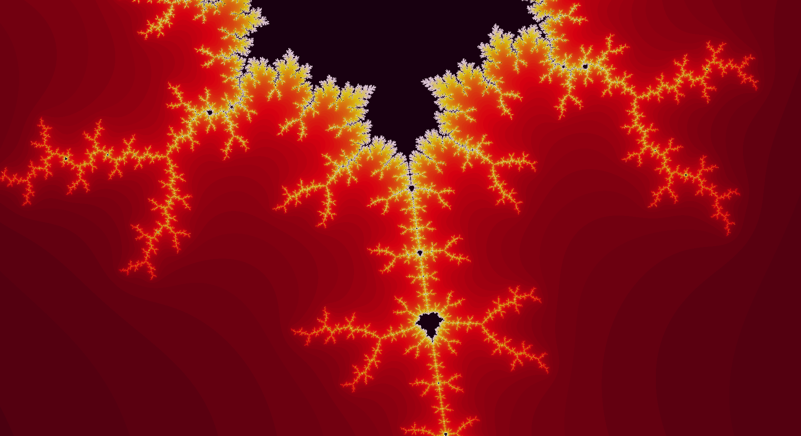

Fractal Trippin
---------------

Aplicación Java para bucear a través del [conjunto de Mandelbrot](https://es.wikipedia.org/wiki/Conjunto_de_Mandelbrot "página de Wikipedia").

También puedes guardar fotos flama en png para tu salvapantallas.

### Modo de empleo

* Clona el repositorio.
* Pega el paquete <code>src/mandelbrot</code> en el workspace de tu IDE.
* Ejecuta el método main de <code>Window.java</code>.
* Enjoy.

### Pictures

Explora <code>doc/samples/</code> para ver más.

 

